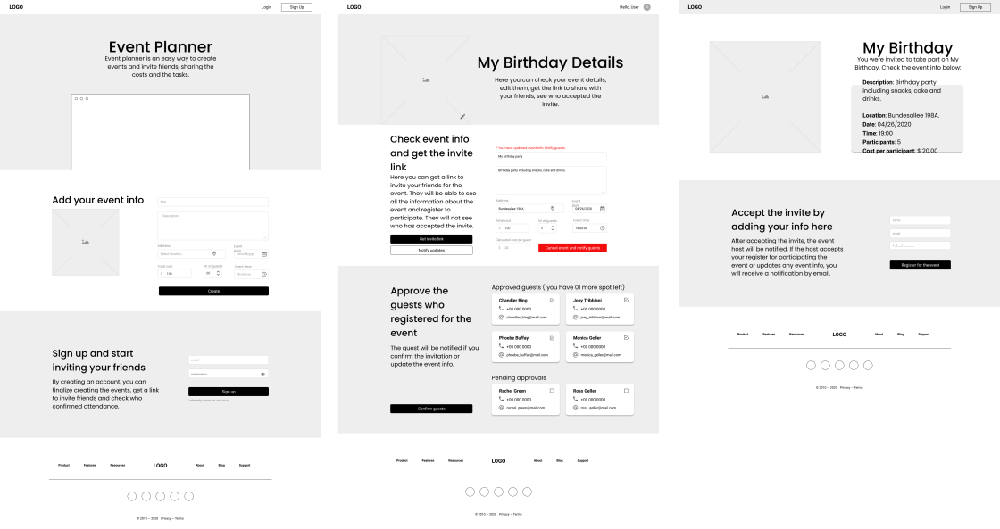
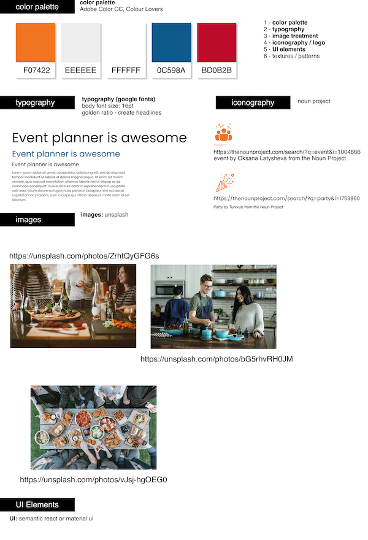
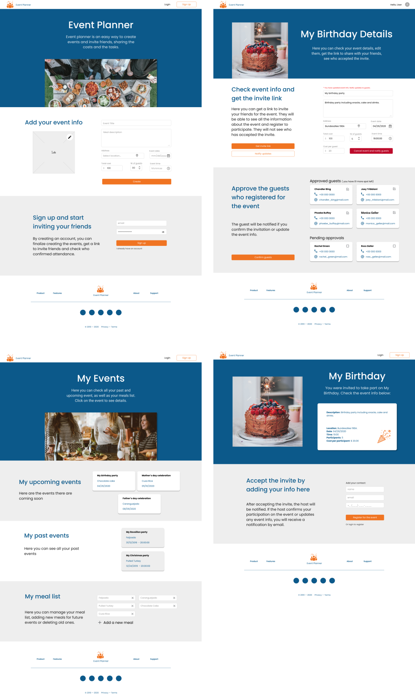
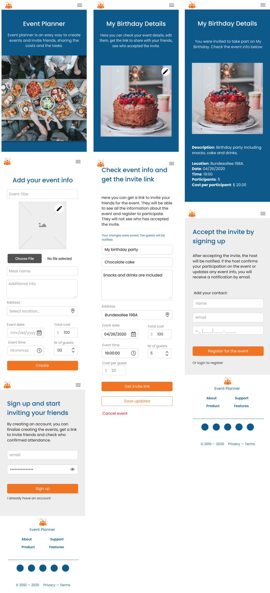

<h1 align="center">My journey creating the Event Planner Web App</h1>

## Introduction
I wrote this article to explain how I created the event planner web app. No, actually, it is about how I think I should have created it, after learning from my own mistakes during the process. But it is a work in progress, considering I'm still working on this app.

### Wireframing

The first step was to create the wireframe of the app. Considering I’m not a UX/UI designer, I decided I wouldn’t spend too much time on this, but it helps a lot to create a not terrible UI, the first impression should be reasonable. 

For this, I used [Figma](https://www.figma.com/), which is free and easy to learn and a few of free wireframe component libraries as well, to make the work easier and quicker.
If you have a great UX designer as a friend, she/he could maybe send you some nice resources for this step (Btw, thanks a lot, [Bamby Gassama!](https://bamby.co/)).

It’s important to make note that if you’re creating a web app, you’ll probably need to create a mobile wireframe as well. And I suggest you to adopt the mobile first principle, it’s so much easier to create a web layout after defining the mobile version, than doing the opposite. Have I done this for this project? Nope. But I was wrong. Don’t do this, start with the mobile version and if you’re not convinced, maybe you should watch this [Kevin Powell video](https://www.youtube.com/watch?v=0ohtVzCSHqs) to understand why it’s better.

### UI Layout

Then, after getting a satisfactory wireframe, I moved on to the layout, still using Figma and the previous wireframe. Here, I would suggest that, unless you know what you’re doing, don’t try to do something too fancy, with many colours, fonts and animations.

Less is more, specially if you’re not a professional. Just because you are a CSS master and know how to add tons of animations, doesn’t mean you need to showcase all your abilities on the same project. Here follow the steps I did in order to create my layout:

#### Style Tile

Before starting the UI definition, I created a Style Tile based on a [Jesse Showalter video](https://www.youtube.com/watch?v=3xWViyhRGd4) on YouTube:

- Color palette: for this, I got inspiration from and [Colour Lovers](https://www.colourlovers.com/), but I decided to use just 2 more vibrant colours and the others are white, light grey and another vibrant colour just for really small sections.

- Typography: I follow what Showalter suggests on his video and decided to choose just one font family and explore different font sizes and weights, I got it from [google fonts](https://fonts.google.com/) and added to my project. It helps to compare different families with different sizes side by side to decide which one fits the best your web app needs.

- Images: for the images, I found some on [Unsplash](https://unsplash.com/) and added some treatment if necessary. Don’t forget to add references for the photos, they’re free but you should give credit to the photographer anyway. 

- Iconography: you can find free icons from different sources, I found some on [Noun project](https://thenounproject.com/) website. If you don’t want to create a personalized logo and favicon, you can also use one of those icons for that. Don’t forget to give credits as well.

- UI elements: well, I confess I didn’t invest much time on this. I decided I would use [material UI](https://material-ui.com/pt/) or [semantic react](https://react.semantic-ui.com/) if necessary, but I didn’t search about this in upfront. 

#### Creating the layout

After having defined the wireframe and the style tile, I found it pretty easy to mesh them together to create a simple layout with a few adjustments. I know the result is not sophisticated, but again, I’m not a UX/UI designer and I’m happy with the results.
It was enough to finally move on to start coding.

### Defining the stack and tools

Before actually starting coding, I defined the stack and created a [Trello](https://trello.com/) board, to help me plan the steps and tasks. Here follows the tools I decided to use:

- [React](https://reactjs.org/): for building the UI. Using [create-react-app](https://reactjs.org/docs/create-a-new-react-app.html) is a simple way to bootstrap a project, so I decided to go for it. I also decided to incorporate [hooks](https://reactjs.org/docs/hooks-intro.html), which I’d used before but I didn’t know in depth.

- [Redux](https://redux.js.org/): for state management. I know using Redux is not always necessary, considering it add some complexity to the project that is not always beneficial, specially for small projects, but I decided to go for it to learn in more depth.

- [Typescript](https://www.typescriptlang.org/): for the type checking. Typescript is in high demand and it’s been a while that I tried to use it, but I didn’t learn it so well, then I decided to give it another shot.

- Git: for version control. Adding the project to GitHub is essential, so as having a really good README.md file providing all the necessary information about your code

- Tests: I haven't decided on how to proceed with the tests. Although I've had some experience with Jest and Enzyme before, I don't know if they're the best option for this project. And I do think I should have started testing this app from the beginning, but I haven't. Mainly because I was already trying to make the hooks work well with Redux and Typescript at the same time and I thought it will be overwhelming for now. I'll have to work on that later.

If you’re building a frontend project alone, you can easily mock up a backend, but if you have the chance, I’d suggest to partner up with a backend developer to create the project. I learned a lot by working with a partner, many things started making sense to me after I did this project, specially because he’s more experienced than me and could clarify many of my questions. And it was also gratifying to realize that I also had some things to teach him, even thought I’m still a junior.

For the backend information, you can check the Magno Ferreira's [event-planner-service](https://github.com/JMagnoJunior/event-planner-service) repository.

### Starting the project

I know many people struggle to understand documentation, but it should be your best friend. That and the forums, of course, where you can get help from peers. But I found out that the React documentation is really helpful, but Redux’s is even more. 
The [Redux style guide](https://redux.js.org/style-guide/style-guide), for instance, helped me a lot to understand many things that were done in courses I’ve taken before, but also showed me I could improve some parts of my code that I learned superficially before.

To start a React app, the [Thinking in React](https://reactjs.org/docs/thinking-in-react.html) section of the React Documentation suggest you to follow these steps:

#### Break the UI into a component hierarchy: 
 Draw boxes around components and subcomponents based on the single responsibility principle.Considering you already have a wireframe, it will be really easy for you to do this step. But if you have already had created a few react apps before, maybe you don’t need to actually draw the boxes, you can just visualize it and maybe scratch a component tree

#### Build a static version in React: 
Don’t use state at all, only hard-coded info passed via props and styles. When I did this step, I didn’t add Redux right away, I just created the pages for each of my previously defined Figma layout. But I did include React Router Dom on this step to make it easier to browse to different pages while coding and had to include Typescript because I used the create-react-app with the flag -—typescript. 

To be honest, I didn’t think it was a good choice at first, because Typescript was really holding me back, making me stop all the time and try to understand why the types I was adding were not correct, but it was the best way to do it. Adding typescript after finishing the project would be possible but I would have to change everything at once and, considering I was just starting to learn it, it was better to add it along the way. Slower, yes, but easier. 

And after starting using Typescript I’d say you start to truly understand what’s going on on your app and what kind of data you get from each operation. So I’d totally recommend to learn it to enhance your javascript applications in general. 

I personally like to build the static version top-down, but you can also build it bottom-up if you think it’s better. As I said before, I recommend the mobile first approach when styling your web app. And, don’t forget the principle of single responsibility. If your component does more than one task, maybe you should separate it in more components.

#### Identify the minimal representation of UI State: 
This is not as simple as it sounds. Specially when you decide to incorporate Redux to your project. The React documentation gives you 3 questions you should ask yourself to identify wether an information should be a prop or a state, if the answer is yes, probably it isn’t state: 
- Is it passed in from a parent via props?
- Does it remain unchanged over time?
- Can you compute it based on any other state or props in your component? 

I used to skip this step and create the state while I was coding, but when you start using Redux, it’s a little bit different. But for this current project I’m working on, I tried to define the state tree upfront, but I ended up changing it over time, when I realized I was missing many necessary information. Probably a more experienced developer can make a better prediction on this step, but if you’re just starting out, you should know that you’ll probably change your state tree along the way, but you still should to define a basic state tree here to help you to plan your architecture better.

#### Identify where your state should live. 
React has a one-way data flow down the component hierarchy and it’s important to define which components will need some piece of state, because it would determine where the state should live. But, if you’re using Redux, this is also something you should think about. 

At first, I thought if I was using Redux, all my state would be on the store and considering all the components can have access to the store directly, that was it. But that’s not completely true. I mean, you still can do that, but that’s not necessary. Some states you’ll only need in a component level, so it doesn’t make sense to have them on the store. 

I was trying to understand where each piece of state should live and I found a very nice explanation on the [Redux documentation](https://redux.js.org/faq/organizing-state#do-i-have-to-put-all-my-state-into-redux-should-i-ever-use-reacts-setstate). So keep in mind that, even though one of the three principles of Redux say "the state of your whole application is stored in a single tree”, still make sense to have form data stored in a component level state, for instance. And some data could also be stored on the local storage, depending on the situation. That’s why you should really take some time to understand this and plan it ahead.

### Adding Redux 

After having created the static version of the app using React and then adding some local states and passing info via props, including hooks which I didn’t know a lot about, I started to include the Redux part.

Although I already understood the three principles of Redux applications, I admit I still struggle to define the state tree, the actions and the reducers. Specially when it comes to asynchronous operations to communicate with the server and you have to add some kind of middleware like Thunk. And now, using Typescript, I thought it was even more challenger. 

[ CONTINUE... ]
