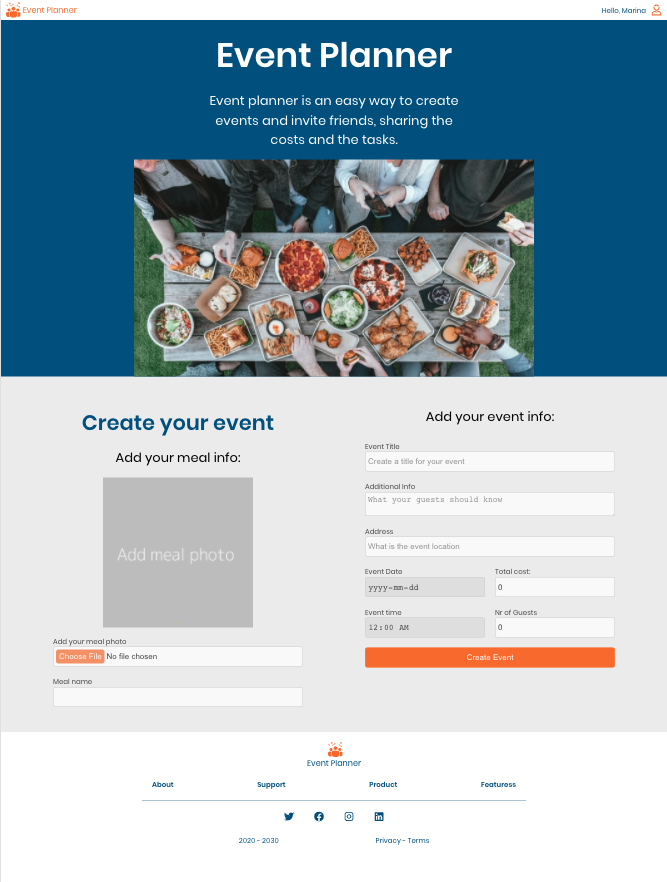

<p align="center"><a href="https://github.com/MarinaFroes/Event_Planner" target="_blank"></a></p>
<h1 align="center">Event Planner Web App</h1>

This app aims to provide an easy way to plan events and invite friends sharing the costs with them.
<!-- TODO: Describe how it works -->

## Overview
<p align="center"></p>

## Tech stack

- React
- Redux
- Typescript
<!-- TODO: Add the rest of the tech stack -->
IN PROGRESS
 
## Frontend

- I built a React/Redux front end for the application using the [Create React App](https://github.com/facebook/create-react-app) to bootstrap the project.

### Available data

There are 2 types of objects stored in the database:

* Users
* Events
* Subjects
* Tasks

#### Users

- Users include:

| Attribute    | Type             | Description                  |
|--------------|------------------|------------------------------|
| id           | String           | The user’s unique identifier |
| name         | String           | The user’s name              |
| email        | String           | The user’s e-email address   |

<!-- TODO: Add avatarUrl, events, phone
| avatarURL  | String           | The path to the image file |
| events | Array | A list of ids of the events this user created|
| phone  | String | The user’s phone number (optional) |
 -->

#### Events

- Events include:

| Attribute | Type | Description |
|-----------------|------------------|-------------------|
| id              | String | The event’s unique identifier |
| title          | String           | The event’s name |
| host | Object | Object containing the host id, name and email  |
| subject         | Object           | Object containing the meal id, name and url of the meal photo |
| additionalInfo  | String     | Additional info (optional) |
| date        | Date | The event's date |
| time        | Time | The event's time |
| address         | String           | The event’s location |
| maxNumberGuest | Number | The max number of guests for the event|
| tasks | Array | Array containing tasks objects, including id, details, eventId and owner id, who is responsible for the task|
| totalCost | Number | The event's total cost|
| costPerGuest | Number | The cost per guest |
| guests | Array | Array of guest objects, including id, name and email of the guests who registered for the event |
| timestamp | String | The time when the event was created |

<!-- TODO: Calculate cost per guest on the frontend
| cost_per_guest | Number | The cost per each guest|
 -->

### Services
<!-- TODO: Review services -->
[ SERVICES NEED UPDATE ]
My code talks to the database via the methods listed bellow:

* `_getUsers()`
* `_getEvents()`
* `_saveEvent(event)`
* `_registerToEvent(guest)`
* `_updateGuestStatus(action, eid, gid)`
<!-- TODO: _addUser(user) -->

1) `_getUsers()` Method

*Description*: Get all of the existing users from the database.  
*Return Value*: Object where the key is the user’s id and the value is the user object.

2) `_getEvents()` Method

*Description*: Get all of the existing events from the database.  
*Return Value*: Object where the key is the event’s id and the value is the event object.

3) `_saveEvent(event)` Method

*Description*: Save the event in the database.  
*Parameters*:  Object that includes the following properties: `title`, `subject`, `additionalInfo`, `address`, `date`, `time`, `total_cost`, `max_guests`. More details about these properties:

| Attribute | Type | Description |
|-----------------|------------------|-------------------|
| title          | String           | The event’s name |
| subject | Object | Object containing the name of the meal and meal photo url|
| additionalInfo  | String     | Additional info (optional) |
| address         | String           | The event’s location |
| date        | Date | The event's date |
| time        | Time | The event's time |
| totalCost | Number | The event's total cost|
| maxNumberGuest | Number | The max number of guests the event can support|
| tasks | Array | Array containing task objects including only the details | 

*Return Value*:  An object that has all the previous properties plus the following ones: `id`, `host`, `costPerGuest`, `timestamp` and `guests`. Each `task` object inside the `tasks` array will also include a task id and the event id. The `subject` object will also cointain a meal id. More details about these properties:

| Attribute | Type | Description |
|-----------------|------------------|-------------------|
| id              | String | The event’s unique identifier |
| host | Object | Object containing the authed user id, name and email  |
| costPerGuest | Number | The cost per guest|
| timestamp | String | The time when the event was created |
| guests | Array | Array of guest objects, including id, name and email of the guests who registered for the event. It starts as an empty object. |
| subject  | Object  | Object containing the meal id, name and url of the meal photo |
| tasks | Array | Array containing tasks objects, including id, details, eventId and owner id, who is responsible for the task|

<!-- Status only on frontend? 
| status | String | The event's status, which can be 'upcoming', 'finished' or 'cancelled'. It starts as 'upcoming' |
 -->

4) `_registerToEvent(guest, id)` Method

*Description*: Add a guest to a particular event in the database.
*Parameters*: The event id and the guest object is the authed user object, containing `id`, `name` and `email`. More details about these properties:

| Attribute    | Type             | Description                  |
|--------------|------------------|------------------------------|
| id           | String           | The user’s unique identifier |
| name         | String           | The user’s name              |
| email        | String           | The user’s e-email address   |

*Return Value*:  The event object updated including the guest object on the guests array with the `id`, `name` and `email` properties plus a `status` property. More details about these properties:

| Attribute | Type | Description |
|-----------|------|-------------|
| status | String | Registration status, which can be: 'pending', 'approved' or 'rejected'. It starts as 'pending'.|

5) `_updateGuestStatus(action, eid, gid)` Method

*Description*: Update the guest registration status for a particular event in the database.
*Parameters*: The event id, the guest id and the action, which can be: `approve` or `reject`. 

*Return Value*:  The event object with the `status` property for the specific guest object updated to `approved` or `rejected`.


## How to install and use the frontend
<!-- TODO: Update install and use instructions -->
- Download the files, cd into root directory and run:
```bash
# Install dependencies
$ npm install

# Run the app
$ npm start
```  

## References and Resources

- This project was bootstrapped with [Create React App](https://github.com/facebook/create-react-app).
- [Typescript Documentation](https://www.typescriptlang.org/docs/home)
- Icons: [React Icons](https://react-icons.netlify.com/#/icons/fa)
- [React Documentation](https://reactjs.org)
- [Redux Documentation](https://redux.js.org/)
- [MDN Documentation](https://developer.mozilla.org)

<!-- TODO: Add reference to images and icons -->
### Image and Icons References
| Image or icon | Author | Source |
|-----------------|------------------|-------------------|
|             | Oksana Latysheva | [Noun Project](https://thenounproject.com/search/?q=event&i=1004866) |
|   | Tuva Mathilde Loland | [Unsplash](https://unsplash.com/photos/4rfVL3NNGrA) |
|  | Spencer Davis | [Unsplash](https://unsplash.com/photos/vJsj-hgOEG0) |